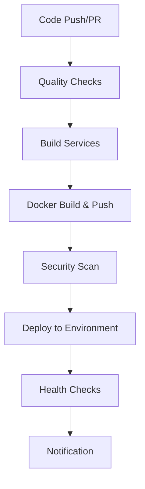

# CI/CD Pipeline Documentation

This document describes the CI/CD pipeline setup for the Ecommerce Microservices project.

## 🚀 Overview

The CI/CD pipeline is built using GitHub Actions and includes:

- **Automated Testing**: Unit tests, integration tests, and security scans
- **Docker Build & Push**: Automated container image building and registry push
- **Multi-Environment Deployment**: Staging and production deployments
- **Security Scanning**: Vulnerability scanning with Trivy
- **Code Quality Checks**: Linting, type checking, and dependency audits
- **Automated Maintenance**: Weekly dependency updates and cleanup

## 📁 Pipeline Structure

### Workflows

| Workflow | Trigger | Purpose |
|----------|---------|---------|
| `ci-cd.yml` | Push to main/dev, PR | Main CI/CD pipeline |
| `pr-validation.yml` | Pull requests | PR validation and testing |
| `maintenance.yml` | Weekly schedule | Automated maintenance tasks |
| `deploy.yml` | Manual trigger | Environment-specific deployments |

### Pipeline Stages



## 🔧 Configuration

### Environment Variables

Create the following environment files:

- `.env.staging` - Staging environment variables
- `.env.production` - Production environment variables

Use `env.prod.template` as a reference for production configuration.

### GitHub Secrets

Configure the following secrets in your GitHub repository:

| Secret | Description |
|--------|-------------|
| `GITHUB_TOKEN` | Automatically provided by GitHub |
| `DEPLOY_TOKEN` | Token for deployment authentication |
| `DATABASE_URL` | Production database connection string |
| `REDIS_URL` | Production Redis connection string |
| `JWT_SECRET` | JWT signing secret |
| `SENDGRID_API_KEY` | SendGrid API key for emails |
| `RESEND_API_KEY` | Resend API key for emails |

### Docker Registry

The pipeline uses GitHub Container Registry (ghcr.io) by default. Images are tagged as:

```
ghcr.io/babascience/ecom-microservices/service-name:tag
```

**Important**: Docker registry names must be lowercase, so `BabaScience` becomes `babascience` in image tags.

## 🚀 Deployment

### Automated Deployment

Deployments are triggered automatically:

- **Staging**: On push to `dev` branch
- **Production**: On push to `main` branch

### Manual Deployment

Use the manual deployment workflow:

1. Go to Actions → "Environment Deployment"
2. Click "Run workflow"
3. Select environment (staging/production)
4. Choose services to deploy
5. Click "Run workflow"

### Local Deployment Scripts

Use the provided deployment scripts:

#### Bash (Linux/macOS)
```bash
# Deploy to staging
./scripts/deploy.sh -e staging

# Deploy specific services to production
./scripts/deploy.sh -e production -s api-gateway,user-service

# Dry run deployment
./scripts/deploy.sh -e staging --dry-run
```

#### PowerShell (Windows)
```powershell
# Deploy to staging
.\scripts\deploy.ps1 -Environment staging

# Deploy specific services to production
.\scripts\deploy.ps1 -Environment production -Services api-gateway,user-service

# Dry run deployment
.\scripts\deploy.ps1 -Environment staging -DryRun
```

## 🧪 Testing

### Test Types

The pipeline includes several types of tests:

1. **Unit Tests**: Service-specific unit tests
2. **Integration Tests**: Cross-service integration tests
3. **Security Tests**: Vulnerability scanning
4. **Health Checks**: Service health validation

### Running Tests Locally

```bash
# Run all tests
bun test

# Run tests for specific service
cd apps/user-service
bun test

# Run linting
bun run lint

# Run type checking
bun run type-check
```

## 🔒 Security

### Security Scanning

The pipeline includes:

- **Trivy**: Container vulnerability scanning
- **Dependency Audit**: Package vulnerability checks with graceful failure handling
- **Code Quality**: Linting and type checking
- **Security Management Scripts**: Automated vulnerability resolution tools

### Security Management Scripts

The project includes comprehensive security management tools:

#### Bash Script (`scripts/security.sh`)
```bash
# Run security audit
./scripts/security.sh --audit

# Fix vulnerabilities automatically
./scripts/security.sh --fix-vulnerabilities

# Update all dependencies
./scripts/security.sh --update

# Check for outdated packages
./scripts/security.sh --check-outdated

# Clean install
./scripts/security.sh --clean
```

#### PowerShell Script (`scripts/security.ps1`)
```powershell
# Run security audit
.\scripts\security.ps1 -Audit

# Fix vulnerabilities automatically
.\scripts\security.ps1 -FixVulnerabilities

# Update all dependencies
.\scripts\security.ps1 -Update

# Check for outdated packages
.\scripts\security.ps1 -CheckOutdated

# Clean install
.\scripts\security.ps1 -Clean
```

### Security Best Practices

1. **Secrets Management**: Use GitHub Secrets for sensitive data
2. **Image Scanning**: All Docker images are scanned for vulnerabilities
3. **Dependency Updates**: Regular dependency updates and security patches
4. **Access Control**: Environment-specific access controls
5. **Graceful Failure Handling**: Security audits don't block deployments for minor issues
6. **Automated Resolution**: Use security scripts for vulnerability management

## 📊 Monitoring

### Pipeline Monitoring

Monitor pipeline status through:

- GitHub Actions dashboard
- Email notifications (configured in repository settings)
- Slack notifications (if configured)

### Service Monitoring

Each service includes:

- Health check endpoints (`/health`)
- Metrics endpoints (if configured)
- Structured logging

## 🛠️ Maintenance

### Automated Maintenance

The maintenance workflow runs weekly and includes:

- Dependency updates
- Docker cache cleanup
- Performance checks
- Documentation validation

### Manual Maintenance

```bash
# Update dependencies
bun update

# Clean Docker cache
docker system prune -f

# Run security audit
bun audit
```

## 🚨 Troubleshooting

### Common Issues

#### Pipeline Failures

1. **Test Failures**: Check test logs and fix failing tests
2. **Build Failures**: Verify Dockerfile and dependencies
3. **Deployment Failures**: Check environment variables and service health

#### Service Issues

1. **Health Check Failures**: Verify service configuration
2. **Database Connection**: Check database credentials and connectivity
3. **Redis Connection**: Verify Redis configuration

### Debug Commands

```bash
# Check service logs
docker-compose logs service-name

# Check service health
curl http://localhost:port/health

# Debug Docker build
docker build -t test-image -f apps/service/Dockerfile .
```

## 📈 Performance

### Optimization Tips

1. **Docker Layer Caching**: Use multi-stage builds and layer caching
2. **Parallel Builds**: Services are built in parallel when possible
3. **Resource Limits**: Configure appropriate resource limits
4. **Health Checks**: Implement proper health check endpoints

### Monitoring Performance

- Monitor build times in GitHub Actions
- Track deployment duration
- Monitor service response times
- Set up alerts for performance degradation

## 🔄 Rollback Procedures

### Automatic Rollback

The production deployment includes automatic rollback on failure.

### Manual Rollback

```bash
# Rollback to previous version
docker-compose down
docker-compose up -d

# Rollback specific service
docker-compose up -d service-name
```

## 📚 Additional Resources

- [GitHub Actions Documentation](https://docs.github.com/en/actions)
- [Docker Documentation](https://docs.docker.com/)
- [Bun Documentation](https://bun.sh/docs)
- [Trivy Security Scanner](https://trivy.dev/)

## 🤝 Contributing

When contributing to the CI/CD pipeline:

1. Test changes in a fork first
2. Update documentation as needed
3. Follow security best practices
4. Test deployment scripts locally
5. Submit pull request with clear description

## 📞 Support

For CI/CD pipeline issues:

1. Check GitHub Actions logs
2. Review this documentation
3. Create an issue with detailed logs
4. Contact the development team
