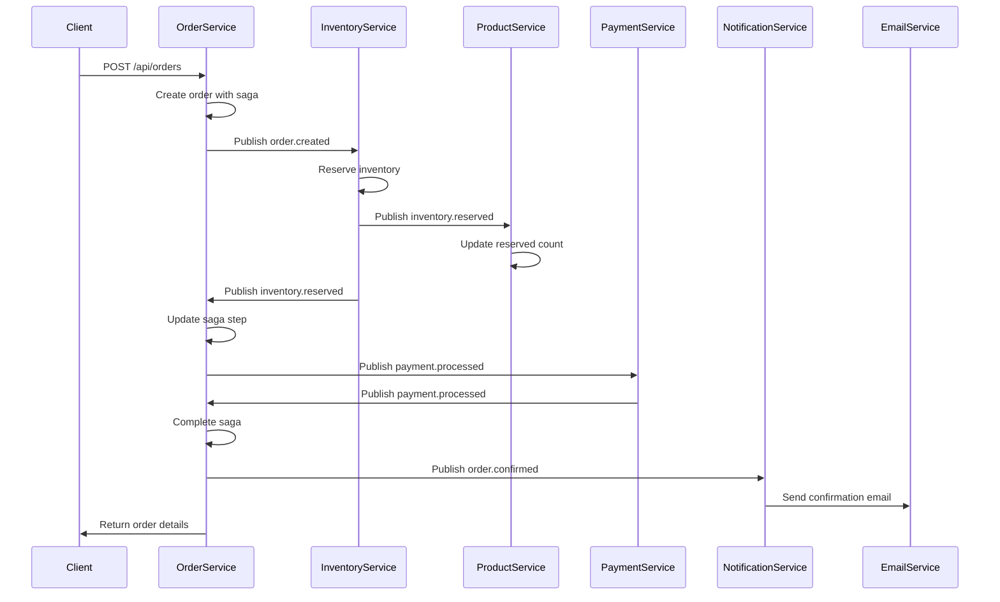
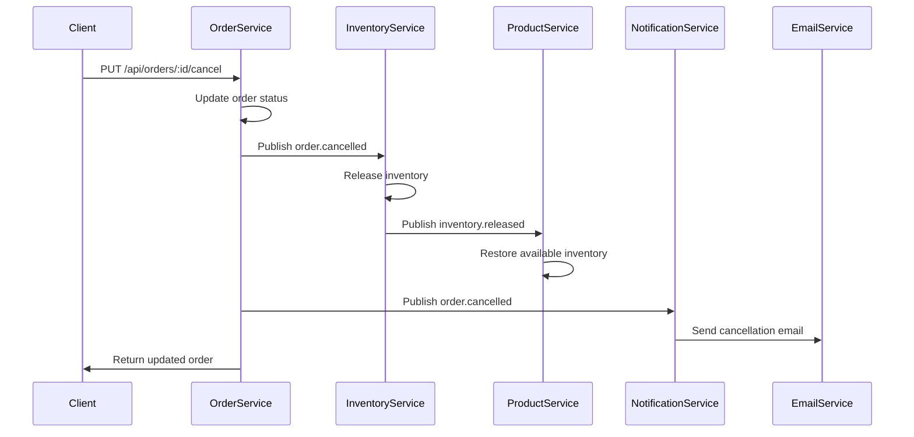
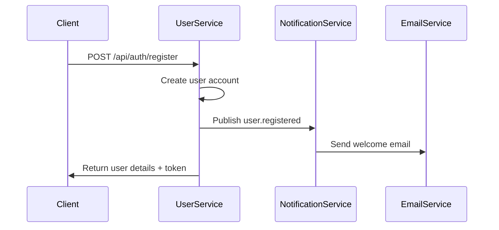
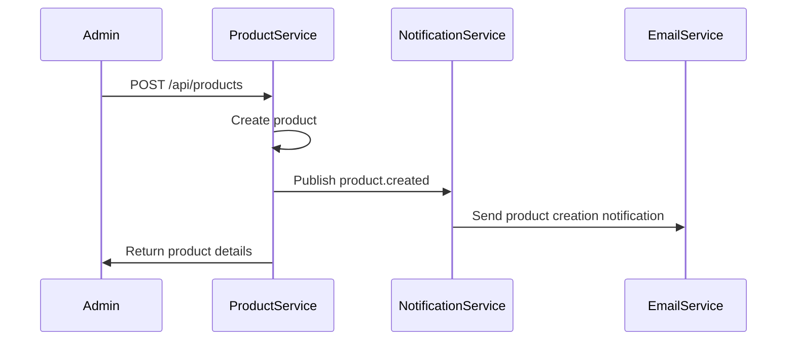
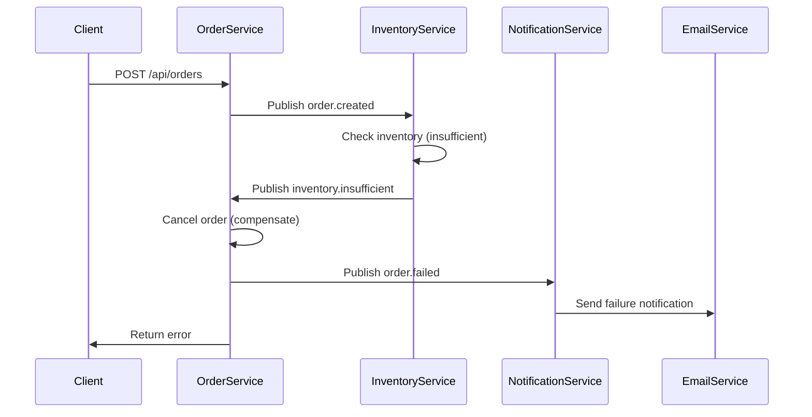

# Event Flows Documentation

This document describes the event flows and communication patterns in the e-commerce microservices architecture.

## Event Types Overview

### Order Events
- `order.created` - Order created and ready for processing
- `order.confirmed` - Order confirmed after payment
- `order.cancelled` - Order cancelled by user or system
- `order.shipped` - Order shipped to customer
- `order.delivered` - Order delivered successfully
- `order.failed` - Order processing failed
- `order.payment_processing` - Payment being processed

### User Events
- `user.registered` - New user registered
- `user.updated` - User profile updated
- `user.deleted` - User account deleted
- `user.password_reset_requested` - Password reset requested

### Product Events
- `product.created` - New product created
- `product.updated` - Product information updated
- `product.deleted` - Product discontinued
- `inventory.updated` - Product inventory updated

### Inventory Events
- `inventory.reserved` - Inventory reserved for order
- `inventory.released` - Reserved inventory released
- `inventory.insufficient` - Insufficient inventory for order
- `inventory.confirmed` - Inventory confirmed and reduced

### Payment Events
- `payment.processed` - Payment processed successfully
- `payment.failed` - Payment processing failed

### Notification Events
- `notification.sent` - Notification sent successfully
- `notification.failed` - Notification sending failed

## Event Producers and Consumers

### Order Service (Producer + Consumer)
**Produces:**
- `order.created` → Inventory Service, Notification Service
- `order.confirmed` → Notification Service
- `order.cancelled` → Inventory Service, Notification Service
- `order.failed` → Notification Service
- `order.payment_processing` → Notification Service

**Consumes:**
- `inventory.reserved` → Update order status
- `inventory.insufficient` → Cancel order
- `payment.processed` → Confirm order
- `payment.failed` → Cancel order

### User Service (Producer)
**Produces:**
- `user.registered` → Email Service
- `user.updated` → Email Service
- `user.deleted` → Email Service
- `user.password_reset_requested` → Email Service

### Product Service (Producer + Consumer)
**Produces:**
- `product.created` → Notification Service
- `product.updated` → Notification Service
- `product.deleted` → Notification Service
- `inventory.updated` → Notification Service

**Consumes:**
- `inventory.reserved` → Update product reserved count
- `inventory.released` → Restore available inventory
- `inventory.confirmed` → Finalize inventory reduction

### Inventory Service (Consumer)
**Consumes:**
- `order.created` → Reserve inventory
- `order.cancelled` → Release reserved inventory

**Produces:**
- `inventory.reserved` → Order Service, Product Service
- `inventory.released` → Order Service, Product Service
- `inventory.insufficient` → Order Service
- `inventory.confirmed` → Product Service

### Notification Service (Consumer)
**Consumes:**
- `order.created` → Send order confirmation email
- `order.confirmed` → Send order confirmation email
- `order.cancelled` → Send cancellation email
- `order.failed` → Send failure notification
- `order.payment_processing` → Send payment processing email
- `user.registered` → Send welcome email
- `user.updated` → Send profile update email
- `user.deleted` → Send account deletion email
- `user.password_reset_requested` → Send password reset email
- `product.created` → Send product creation notification
- `product.updated` → Send product update notification
- `product.deleted` → Send product deletion notification

### Email Service (Consumer)
**Consumes:**
- `notification.tasks` → Send emails via SendGrid

## Detailed Event Flows

### 1. Order Creation Flow



### 2. Order Cancellation Flow



### 3. User Registration Flow



### 4. Product Creation Flow



### 5. Inventory Insufficient Flow



## Event Payload Examples

### Order Created Event

```typescript
{
  eventId: "uuid",
  eventType: "order.created",
  aggregateId: "order-id",
  aggregateType: "Order",
  occurredAt: "2024-01-01T00:00:00Z",
  version: 1,
  correlationId: "correlation-id",
  causationId: null,
  data: {
    orderNumber: "ORD-001",
    userId: "user-id",
    items: [
      {
        productId: "product-id",
        productName: "Product Name",
        quantity: 2,
        unitPrice: 29.99,
        totalPrice: 59.98
      }
    ],
    total: 59.98,
    status: "pending",
    shippingAddress: {
      street: "123 Main St",
      city: "City",
      state: "State",
      zipCode: "12345",
      country: "Country"
    }
  },
  metadata: {
    userId: "user-id",
    source: "order-service",
    environment: "development"
  }
}
```

### Inventory Reserved Event

```typescript
{
  eventId: "uuid",
  eventType: "inventory.reserved",
  aggregateId: "order-id",
  aggregateType: "Order",
  occurredAt: "2024-01-01T00:00:00Z",
  version: 1,
  correlationId: "correlation-id",
  causationId: "order-created-event-id",
  data: {
    orderId: "order-id",
    items: [
      {
        productId: "product-id",
        quantity: 2
      }
    ]
  },
  metadata: {
    source: "inventory-service",
    environment: "development"
  }
}
```

### User Registered Event

```typescript
{
  eventId: "uuid",
  eventType: "user.registered",
  aggregateId: "user-id",
  aggregateType: "User",
  occurredAt: "2024-01-01T00:00:00Z",
  version: 1,
  correlationId: "correlation-id",
  causationId: null,
  data: {
    userId: "user-id",
    email: "user@example.com",
    firstName: "John",
    lastName: "Doe"
  },
  metadata: {
    source: "user-service",
    environment: "development"
  }
}
```

## Event Processing Patterns

### 1. Idempotency

All event processors implement idempotency to handle duplicate events:

```typescript
const processed = await idempotencyGuard.isProcessed(event.eventId);
if (processed) {
  logger.info('Event already processed, skipping', { eventId: event.eventId });
  return { status: 'duplicate', eventId: event.eventId };
}
```

### 2. Error Handling

Events are processed with retry logic and DLQ integration:

```typescript
try {
  await processEvent(event);
  await idempotencyGuard.markAsProcessed(event.eventId, { status: 'success' });
} catch (error) {
  logger.error('Event processing failed', { eventId: event.eventId, error });
  throw error; // Will trigger retry or DLQ
}
```

### 3. Correlation Tracking

Events maintain correlation chains for tracing:

```typescript
const event = eventPublisher.createEvent(
  EventTypes.ORDER_CONFIRMED,
  orderId,
  'Order',
  orderData,
  correlationId,
  previousEventId, // causationId
  userId
);
```

## Queue Configurations

### Order Events Queue
- **Name**: `order.events`
- **Concurrency**: 5
- **Retry Attempts**: 3
- **Priority**: 1

### User Events Queue
- **Name**: `user.events`
- **Concurrency**: 3
- **Retry Attempts**: 3
- **Priority**: 1

### Inventory Events Queue
- **Name**: `inventory.events`
- **Concurrency**: 5
- **Retry Attempts**: 5
- **Priority**: 2 (Higher priority)

### Notification Tasks Queue
- **Name**: `notification.tasks`
- **Concurrency**: 5
- **Retry Attempts**: 5
- **Priority**: 2 (Higher priority)

### Dead Letter Queue
- **Name**: `dead-letter-queue`
- **Concurrency**: 1
- **Retry Attempts**: 1
- **Priority**: Based on error type

## Monitoring and Observability

### Event Metrics

Each service exposes event processing metrics:

- **Events Processed**: Total events processed
- **Events Failed**: Total events that failed
- **Processing Rate**: Events per second
- **Average Processing Time**: Time to process events
- **Queue Depth**: Number of events waiting

### Health Checks

Services expose health checks that include event processing status:

```typescript
app.get('/health', async (req, res) => {
  const eventHealth = await getEventProcessingHealth();
  res.json({
    success: true,
    data: {
      status: 'healthy',
      service: 'order-service',
      events: eventHealth,
      timestamp: new Date().toISOString()
    }
  });
});
```

### Dead Letter Queue Monitoring

Failed events are monitored through DLQ:

```bash
# View DLQ statistics
curl http://localhost:3003/api/dlq/stats

# Retry failed event
curl -X POST http://localhost:3003/api/dlq/retry/{jobId}
```

## Best Practices

### 1. Event Design

- **Single Responsibility**: Each event should represent one business action
- **Immutable**: Event data should not change after creation
- **Versioned**: Include version information for schema evolution
- **Correlated**: Use correlation IDs for tracing

### 2. Error Handling

- **Transient vs Permanent**: Categorize errors appropriately
- **Retry Logic**: Implement exponential backoff
- **Dead Letter Queue**: Move failed events to DLQ for analysis
- **Compensation**: Implement compensating actions for failures

### 3. Performance

- **Batch Processing**: Process multiple events together when possible
- **Async Processing**: Use asynchronous processing for non-critical events
- **Rate Limiting**: Implement rate limiting to prevent overwhelming services
- **Monitoring**: Monitor event processing performance

### 4. Security

- **Authentication**: Authenticate event publishers
- **Authorization**: Authorize event consumers
- **Encryption**: Encrypt sensitive event data
- **Audit Logging**: Log all event processing activities

## Testing Event Flows

### Unit Tests

Test individual event processors:

```typescript
describe('OrderEventProcessor', () => {
  it('should process order created event', async () => {
    const event = createOrderCreatedEvent();
    const result = await orderEventProcessor.process(event);
    expect(result.status).toBe('success');
  });
});
```

### Integration Tests

Test complete event flows:

```typescript
describe('Order Creation Flow', () => {
  it('should complete order creation flow', async () => {
    // Create order
    const orderResponse = await createOrder(orderData);
    
    // Wait for events to be processed
    await waitForEventProcessing();
    
    // Verify order state
    const order = await getOrder(orderResponse.id);
    expect(order.status).toBe('confirmed');
  });
});
```

### Load Tests

Test event processing under load:

```typescript
describe('Event Processing Load Test', () => {
  it('should handle high event volume', async () => {
    const events = generateEvents(1000);
    const results = await Promise.all(events.map(processEvent));
    expect(results.every(r => r.status === 'success')).toBe(true);
  });
});
```
