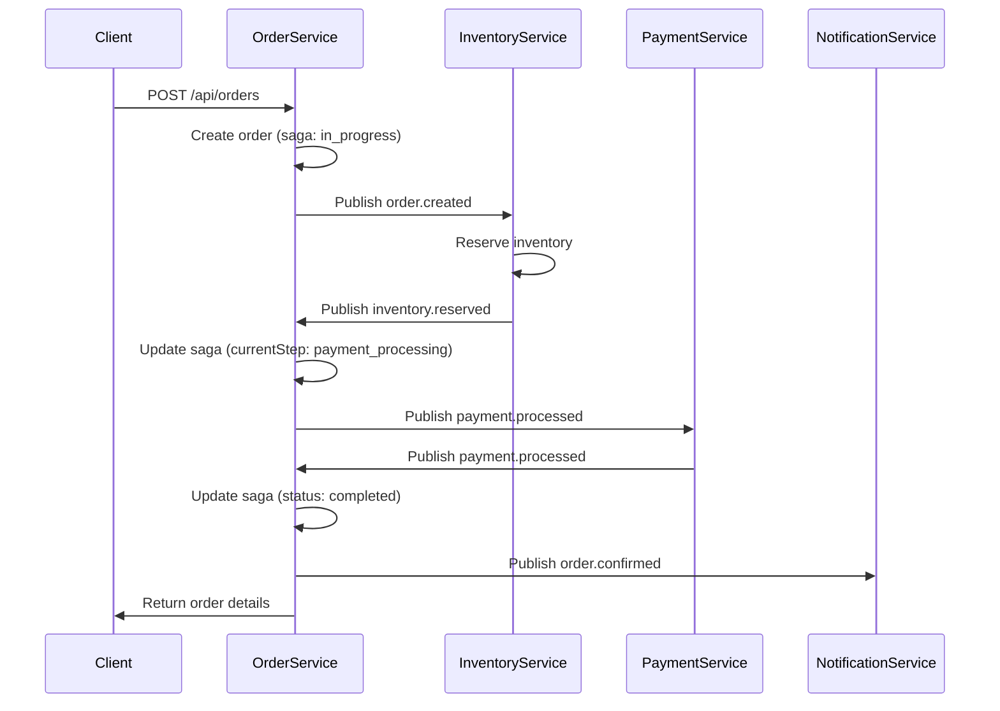
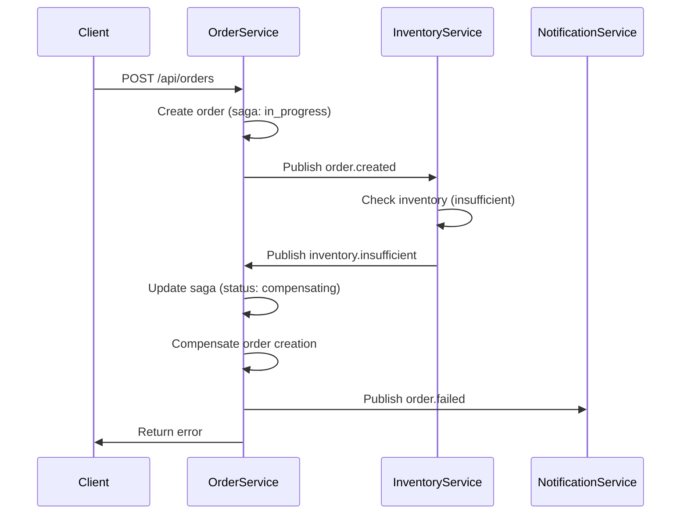

# Saga Pattern Implementation

This document describes the Saga pattern implementation in the Order Service for handling distributed transactions in the e-commerce microservices architecture.

## Overview

The Saga pattern is used to manage distributed transactions across multiple services without using traditional ACID transactions. Instead, it uses a sequence of local transactions with compensating actions to maintain data consistency.

## Order Creation Saga

### State Machine

The order creation saga follows this state machine:

```
order_created → inventory_reserved → payment_processed → order_confirmed
     ↓               ↓                    ↓
   failed ←→ inventory_insufficient ←→ payment_failed
```

### Saga States

- **`in_progress`**: Saga is currently executing
- **`completed`**: All steps completed successfully
- **`compensating`**: Rolling back due to failure
- **`failed`**: Saga failed and cannot be recovered

### Saga Steps

1. **`order_created`**: Order record created in database
2. **`inventory_reserved`**: Inventory reserved for order items
3. **`payment_processed`**: Payment processed successfully
4. **`order_confirmed`**: Order confirmed and ready for fulfillment

## Implementation Details

### Order Model Schema

```typescript
interface IOrder {
  saga: {
    id: string;                    // Unique saga identifier
    status: 'in_progress' | 'completed' | 'compensating' | 'failed';
    currentStep: string;           // Current step in the saga
    completedSteps: string[];     // Steps completed successfully
    compensatedSteps: string[];   // Steps that have been compensated
  };
  status: 'pending' | 'payment_processing' | 'confirmed' | 'processing' | 'shipped' | 'delivered' | 'cancelled' | 'failed';
  // ... other fields
}
```

### Saga Orchestrator

The `SagaOrchestrator` class manages the saga execution:

```typescript
class SagaOrchestrator {
  async startOrderSaga(orderId: string): Promise<void> {
    // Start the saga by publishing order.created event
    // Inventory Service will consume this and reserve inventory
  }

  async handleInventoryReserved(orderId: string): Promise<void> {
    // Move to next step: payment processing
    // Update saga state and publish payment event
  }

  async handleInventoryInsufficient(orderId: string): Promise<void> {
    // Compensate: cancel the order
    // Update saga status to compensating
  }

  async handlePaymentProcessed(orderId: string): Promise<void> {
    // Move to final step: order confirmation
    // Update saga status to completed
  }

  async handlePaymentFailed(orderId: string): Promise<void> {
    // Compensate: release inventory and cancel order
    // Update saga status to compensating
  }
}
```

### Compensating Transactions

When a step fails, compensating transactions are executed:

1. **Inventory Compensation**: Release reserved inventory
2. **Payment Compensation**: Refund processed payment
3. **Order Compensation**: Cancel the order

```typescript
class Compensations {
  static async compensateInventoryReservation(orderId: string): Promise<void> {
    // Release reserved inventory
    // Publish inventory.released event
  }

  static async compensatePayment(orderId: string): Promise<void> {
    // Process refund
    // Publish payment.refunded event
  }

  static async compensateOrder(orderId: string): Promise<void> {
    // Cancel the order
    // Update order status to cancelled
  }
}
```

## Event Flow

### Successful Order Creation



### Failed Order Creation (Inventory Insufficient)



## Error Handling

### Retry Logic

- **Transient Errors**: Automatically retried with exponential backoff
- **Permanent Errors**: Moved to Dead Letter Queue for manual intervention
- **Timeout Errors**: Compensated after timeout period

### Dead Letter Queue Integration

Failed saga steps are moved to DLQ for analysis:

```typescript
// In worker error handler
if (job.attemptsMade >= maxAttempts) {
  await DLQPublisher.moveToDLQ(
    'order.events',
    job.id.toString(),
    job.data,
    error.message,
    error.message,
    {
      service: 'order-service',
      environment: process.env.NODE_ENV,
      correlationId: job.data.correlationId
    }
  );
}
```

## Monitoring and Observability

### Saga Metrics

- **Saga Completion Rate**: Percentage of sagas that complete successfully
- **Average Saga Duration**: Time from start to completion
- **Compensation Rate**: Percentage of sagas that require compensation
- **Step Failure Rate**: Failure rate for each saga step

### Health Checks

The Order Service exposes saga health metrics:

```typescript
app.get('/health', async (req, res) => {
  const sagaHealth = await getSagaHealth();
  res.json({
    success: true,
    data: {
      status: 'healthy',
      service: 'order-service',
      saga: sagaHealth,
      timestamp: new Date().toISOString()
    }
  });
});
```

## Best Practices

### 1. Idempotency

All saga steps must be idempotent:

```typescript
const processed = await idempotencyGuard.isProcessed(event.eventId);
if (processed) {
  return { status: 'duplicate', eventId: event.eventId };
}
```

### 2. Event Ordering

Use correlation IDs to maintain event ordering:

```typescript
const event = eventPublisher.createEvent(
  EventTypes.ORDER_CREATED,
  orderId,
  'Order',
  orderData,
  correlationId,
  causationId,
  userId
);
```

### 3. Compensation Safety

Compensating transactions should be safe to execute multiple times:

```typescript
async compensateInventoryReservation(orderId: string): Promise<void> {
  // Check if already compensated
  const order = await Order.findById(orderId);
  if (order.saga.compensatedSteps.includes('inventory_reserved')) {
    return; // Already compensated
  }
  
  // Execute compensation
  await releaseInventory(orderId);
  
  // Mark as compensated
  order.saga.compensatedSteps.push('inventory_reserved');
  await order.save();
}
```

### 4. Timeout Handling

Set appropriate timeouts for each saga step:

```typescript
const sagaTimeout = 30000; // 30 seconds
const timeoutJob = await orderEventsQueue.add(
  'saga-timeout',
  { orderId, sagaId },
  { delay: sagaTimeout }
);
```

## Troubleshooting

### Common Issues

1. **Stuck Sagas**: Sagas that remain in `in_progress` state
   - **Solution**: Implement timeout mechanism and compensation

2. **Duplicate Events**: Same event processed multiple times
   - **Solution**: Use idempotency guards and event deduplication

3. **Compensation Failures**: Compensating transactions fail
   - **Solution**: Implement retry logic for compensations

4. **Event Ordering**: Events processed out of order
   - **Solution**: Use correlation IDs and event versioning

### Debugging Tools

1. **Saga State Inspection**:
   ```bash
   # Check saga state for specific order
   curl http://localhost:3003/api/orders/{orderId}
   ```

2. **DLQ Monitoring**:
   ```bash
   # View failed saga steps
   curl http://localhost:3003/api/dlq/stats
   ```

3. **Event Tracing**:
   ```bash
   # Trace events by correlation ID
   curl http://localhost:3003/api/orders?correlationId={correlationId}
   ```

## Testing

### Unit Tests

Test individual saga steps:

```typescript
describe('SagaOrchestrator', () => {
  it('should handle inventory reserved event', async () => {
    const orderId = 'test-order-id';
    await sagaOrchestrator.handleInventoryReserved(orderId);
    
    const order = await Order.findById(orderId);
    expect(order.saga.currentStep).toBe('payment_processing');
  });
});
```

### Integration Tests

Test complete saga flows:

```typescript
describe('Order Creation Saga', () => {
  it('should complete successfully', async () => {
    const orderData = { /* test order data */ };
    const response = await request(app)
      .post('/api/orders')
      .send(orderData);
    
    expect(response.status).toBe(201);
    
    // Wait for saga completion
    await waitForSagaCompletion(response.body.data.order._id);
    
    const order = await Order.findById(response.body.data.order._id);
    expect(order.saga.status).toBe('completed');
  });
});
```

## Future Enhancements

1. **Saga Visualization**: Web UI to visualize saga execution
2. **Automatic Recovery**: Self-healing mechanisms for stuck sagas
3. **Saga Templates**: Reusable saga patterns for different use cases
4. **Performance Optimization**: Parallel execution where possible
5. **Advanced Monitoring**: Real-time saga metrics and alerting
